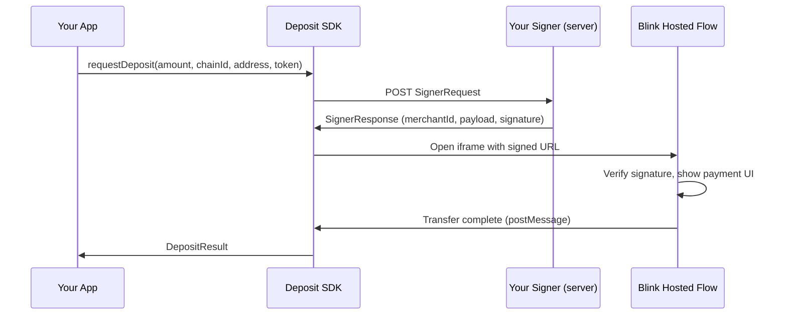

Blink lets merchants accept payments through a hosted deposit flow. Your app opens a secure modal iframe powered by Blink, and your users complete the payment without leaving your site. There is nothing to PCI-scope, no wallet UI to build, and no on-chain logic to manage.

## How it works

1. Your frontend calls the Deposit SDK with a transfer amount and destination.
2. The SDK calls your **signer endpoint** — a server-side route you build that signs each payment request with your ECDSA private key.
3. The SDK opens a **modal iframe** containing Blink's hosted payment UI.
4. The user authenticates, connects a wallet, and completes the payment inside the iframe.
5. On completion, the SDK returns a `DepositResult` with the transfer ID and status.

## What you need to build

| Component | Where | What |
|-----------|-------|------|
| **Signer endpoint** | Your server | An HTTP endpoint that validates payment requests, signs them with your private key, and returns a `SignerResponse`. |
| **Deposit integration** | Your frontend | A few lines of code using the `@swype-org/deposit` SDK (vanilla JS or React) to trigger the payment flow. |

Blink handles everything else: user authentication, wallet connection, on-chain transfers, and cross-chain bridging.

## Key concepts

| Term | Definition |
|------|------------|
| **Merchant Signer** | A server-side endpoint you build that creates and cryptographically signs payment requests. The private key never leaves your server. |
| **Payload** | A base64url-encoded JSON string containing payment parameters (amount, chain, address, token, idempotency key, expiration). |
| **Signature** | An ECDSA P-256 SHA-256 signature over the payload string, base64url-encoded. Blink verifies this against your registered public key. |
| **Idempotency Key** | A UUID v4 generated per payment request. Prevents duplicate transfers if the same request is submitted twice. |
| **Hosted Flow** | Blink's payment UI that opens in a modal iframe. It handles user authentication, wallet connection, and the actual transfer. |
| **Deposit SDK** | The client-side library (`@swype-org/deposit`) that orchestrates the signer call and hosted flow lifecycle. |

## Next steps

<CardGroup cols={2}>
  <Card title="Quickstart" icon="rocket" href="/quickstart">
    Get a working integration in 5 minutes.
  </Card>
  <Card title="Architecture" icon="diagram-project" href="/integration/architecture">
    Understand the full payment flow in detail.
  </Card>
</CardGroup>
