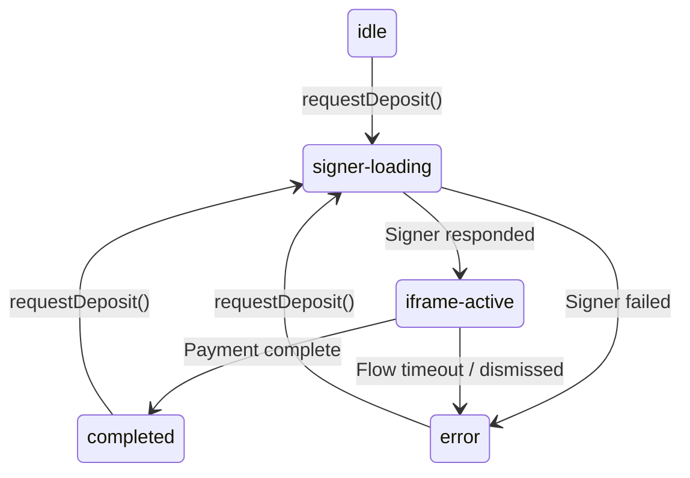

The `Checkout` class emits events during the payment flow. Use `on()` and `off()` to subscribe and unsubscribe.

## Events

### complete

Fired when the payment completes successfully. The handler receives a `DepositResult`.

```typescript
checkout.on('complete', (result: DepositResult) => {
  console.log('Transfer ID:', result.transfer.id);
  console.log('Status:', result.transfer.status);
});
```

### error

Fired when the payment flow fails. The handler receives a `CheckoutError`.

```typescript
checkout.on('error', (error: CheckoutError) => {
  console.error('Checkout failed:', error.code, error.message);
});
```

### close

Fired when the checkout iframe is dismissed (user tapped backdrop, pressed Escape, or the flow was closed programmatically).

```typescript
checkout.on('close', () => {
  console.log('Checkout closed');
});
```

### status-change

Fired on every status transition. The handler receives the new `CheckoutStatus`.

```typescript
checkout.on('status-change', (status: CheckoutStatus) => {
  console.log('Status:', status);
});
```

## Status transitions



| Status | Meaning |
|--------|---------|
| `idle` | No active flow. Initial state and state after `close()` or `destroy()`. |
| `signer-loading` | The SDK is calling the merchant signer endpoint. |
| `iframe-active` | The hosted flow iframe is open. Waiting for the user to complete payment. |
| `completed` | Transfer succeeded. `result` is available. |
| `error` | Something failed. `error` is available. |

## Subscribing and unsubscribing

```typescript
const onComplete = (result: DepositResult) => {
  updateUI(result);
};

// Subscribe
checkout.on('complete', onComplete);

// Unsubscribe
checkout.off('complete', onComplete);
```

Both `on()` and `off()` return `this` for chaining:

```typescript
checkout
  .on('complete', handleComplete)
  .on('error', handleError)
  .on('close', handleClose);
```

## Lifecycle management

### close()

Closes the checkout iframe and resets status to `idle`. Fires the `close` event. Does not destroy the instance — you can call `requestDeposit()` again.

```typescript
checkout.close();
```

### destroy()

Closes the iframe, removes all event listeners, and marks the instance as destroyed. Subsequent calls to `requestDeposit()` will reject with `INVALID_REQUEST`.

Call this when the component unmounts or the page unloads.

```typescript
// Vanilla JS — on page unload
window.addEventListener('beforeunload', () => checkout.destroy());

// React — handled automatically by useBlinkCheckout
```

<Warning>
Always call `destroy()` when the checkout is no longer needed to prevent memory leaks from lingering event listeners.
</Warning>

## React lifecycle

The `useBlinkCheckout` hook manages the `Checkout` instance lifecycle automatically:

- Creates the instance on first render.
- Subscribes to `status-change`, `complete`, and `error` events.
- Cleans up all subscriptions and calls `destroy()` on unmount.

You do not need to call `destroy()` manually when using the React hook.
